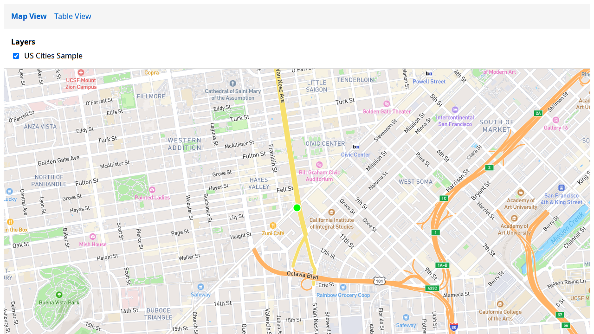

``# GeoJSON Review: Forward Button Demo

*2026-02-15T21:11:49Z by Showboat 0.5.0*

Open the review app and capture initial state (Feature 1 of 5).

```bash
playwright-cli open http://localhost:5174
```

````output
### Browser `default` opened with pid 108071.
- default:
  - browser-type: chrome
  - user-data-dir: <in-memory>
  - headed: false
---
### Ran Playwright code
```js
await page.goto('http://localhost:5174');
```
### Page
- Page URL: http://localhost:5174/map
- Page Title: GeoJSON Review Tool
- Console: 0 errors, 1 warnings
### Snapshot
- [Snapshot](.playwright-cli/page-2026-02-15T21-12-08-272Z.yml)
````

```bash
playwright-cli snapshot
```

```output
### Page
- Page URL: http://localhost:5174/map
- Page Title: GeoJSON Review Tool
- Console: 0 errors, 4 warnings
### Snapshot
- [Snapshot](.playwright-cli/page-2026-02-15T21-12-20-556Z.yml)
### Events
- New console entries: .playwright-cli/console-2026-02-15T21-12-07-868Z.log#L1-L4
```

Take a screenshot before clicking Forward.

```bash
playwright-cli screenshot
```

````output
### Result
- [Screenshot of viewport](.playwright-cli/page-2026-02-15T21-12-36-140Z.png)
### Ran Playwright code
```js
// Screenshot viewport and save it as .playwright-cli/page-2026-02-15T21-12-36-140Z.png
await page.screenshot({
path: '.playwright-cli/page-2026-02-15T21-12-36-140Z.png',
  scale: 'css',
  type: 'png'
});
```
````

```bash {image}

```



Click the Forward button (ref e23 from snapshot).

```bash
playwright-cli click e23
```

````output
### Ran Playwright code
```js
await page.getByRole('button', { name: 'Forward →' }).click();
```
### Page
- Page URL: http://localhost:5174/map
- Page Title: GeoJSON Review Tool
- Console: 0 errors, 4 warnings
### Snapshot
- [Snapshot](.playwright-cli/page-2026-02-15T21-13-03-848Z.yml)
````

Screenshot after clicking Forward — now showing Feature 2 of 5.

```bash
playwright-cli screenshot
```

````output
### Result
- [Screenshot of viewport](.playwright-cli/page-2026-02-15T21-13-17-725Z.png)
### Ran Playwright code
```js
// Screenshot viewport and save it as .playwright-cli/page-2026-02-15T21-13-17-725Z.png
await page.screenshot({
path: '.playwright-cli/page-2026-02-15T21-13-17-725Z.png',
  scale: 'css',
  type: 'png'
});
```
````

```bash {image}

```


```bash
playwright-cli close
```

```output
Browser 'default' closed

```
