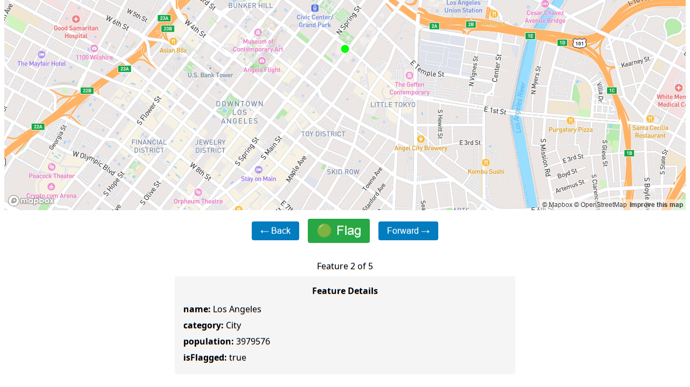

# GeoJSON Review: Forward Button Demo (agent-browser)

_2026-02-15T21:19:39Z by Showboat 0.5.0_

Open the review app and capture initial state (Feature 1 of 5).

```bash
agent-browser open http://localhost:5174
```

```output
✓ GeoJSON Review Tool
  http://localhost:5174/
```

```bash
sleep 3 && agent-browser snapshot
```

```output
- document:
  - navigation:
    - link "Map View" [ref=e1]:
      - /url: /map
    - link "Table View" [ref=e2]:
      - /url: /table
  - main:
    - heading "Layers" [ref=e3] [level=3]
    - checkbox "US Cities Sample" [ref=e4] [checked]
    - text: US Cities Sample
    - region "Map" [ref=e5]
    - link "© Mapbox" [ref=e6]:
      - /url: https://www.mapbox.com/about/maps
    - link "© OpenStreetMap" [ref=e7]:
      - /url: https://www.openstreetmap.org/copyright/
    - link "Improve this map" [ref=e8]:
      - /url: https://apps.mapbox.com/feedback/?owner=mapbox&id=streets-v12&access_token=<MAPBOX_TOKEN>#/-122.4194/37.7749/14
    - link "Mapbox homepage" [ref=e9]:
      - /url: https://www.mapbox.com/
    - button "← Back" [ref=e10] [disabled]
    - button "🟢 Flag" [ref=e11]
    - button "Forward →" [ref=e12]
    - text: Feature 1 of 5
    - heading "Feature Details" [ref=e13] [level=3]
    - strong: "name:"
    - text: San Francisco
    - strong: "category:"
    - text: City
    - strong: "population:"
    - text: "873965"
    - strong: "isFlagged:"
    - text: "true"
```

Take a screenshot before clicking Forward.

```bash
agent-browser screenshot /tmp/ab-before.png
```

```output
✓ Screenshot saved to /tmp/ab-before.png
```

```bash {image}

```


Click the Forward button (ref @e12 from snapshot).

```bash
agent-browser click @e12
```

```output
✓ Done
```

Screenshot after clicking Forward — now showing Feature 2 of 5.

```bash
agent-browser screenshot /tmp/ab-after.png
```

```output
✓ Screenshot saved to /tmp/ab-after.png
```

```bash {image}

```



```bash
agent-browser close
```

```output
✓ Browser closed
```
